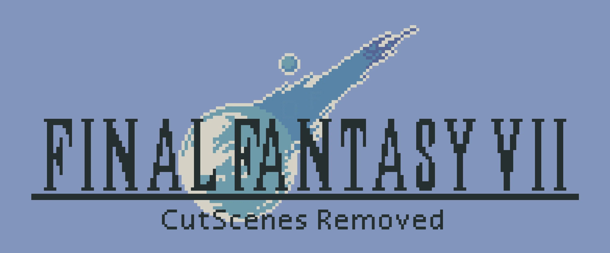
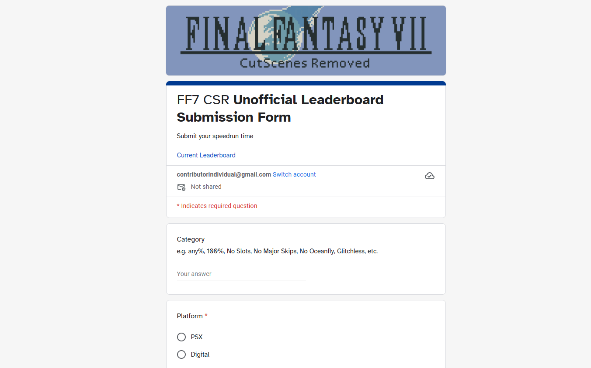

*Artist: @Cronosart99*

## Final Fantasy 7 PSX CutScenes Removed

Works with all the variants, e.g. No Major Skips, Glitchless, Slots, All Bosses etc.

Category | Status
-------- | ------
any% No Slots | 🟢 Done
any% Slots | 🔄 Work in Progress 
any% No Major Skips | 🔄 Work in Progress 
any% All Bosses | 🔄 Work in Progress 
100% No Slots | 🔄 Work in Progress 


These patches can be applied to the following platforms

- Playstation 1 and 2 (PSX Disc)
- Emulator (Digital)

## Definition

All "skill checks" remain in this CSR (if not let me know and I'll fix it). A skill check is any action a player must perform in game, e.g. choosing an option in dialogues, movement in cutscenes, skips, manipulating RNG, etc. Most FMVs are removed, some cutscenes are shorter, and long mashing sequences have been reduced. This CSR is exactly like a non-CSR run, just shorter.

## Contributors
- IndividualContributor
- Okamikaze
- AwesomeWaves
- Teeejj
- Shoutblaster
- HopeDRG
- Doumeis
- Cornfed69
- Phek1200
- MuscleBelt
- Rendall
- Expans3
- Katombaz

## Getting Started

Apply the patches to your FF7 NTSC/US PS1 .bin files.

1. Go to https://www.romhacking.net/patch/
2. Select your original .bin file, ignore the "file too big" warning
3. Select the patch .ppf file
4. Click the "Apply patch" button

Your browser should download a new patched version of the disc, just load it up using the latest [Duckstation](https://github.com/stenzek/duckstation/releases) release. 

See [Troubleshoting](#troubleshooting) to make sure your patch files correctly named.

## Play on PSX

You'll need to first use something like [MechaPwn](https://github.com/MechaResearch/MechaPwn) to soft-mod your PS2 Slim in order to play your backup discs.

Then, you can burn the patched .bin file to disc, make sure to select the associated .cue file in your CD burning software. I use ImgBurn with write speed 16x on Verbatim CD-R 700MB discs.

# Unofficial Leaderboard



[Submit your speedrun time here](https://forms.gle/byFWCT85gFWS2Vtp6)

[Current Leaderboard](https://docs.google.com/spreadsheets/d/19y6yHtODjS5R-VyvtHUKjAo3FL9Fif56p1REQsUzGWg)


# Feature Requests and Bug Fixes

Feature Requests and Bug Fixes https://forms.gle/dW9rMCD9kQ3eBPSM8


## Troubleshooting

Make sure to choose the correct patch .ppf file for the correct disc you are trying to patch.

Also check your FF7 .bin and .cue files for all discs are in the same directory, and the .bin and .cue for each disc are named exactly the same. e.g. 

```text
- Final Fantasy VII (Disc 1) CSR (patched).bin  
- Final Fantasy VII (Disc 1) CSR (patched).cue  
- Final Fantasy VII (Disc 2) CSR (patched).bin  
- Final Fantasy VII (Disc 2) CSR (patched).cue  
- Final Fantasy VII (Disc 3).bin  
- Final Fantasy VII (Disc 3).cue
```

You should also verify that .cue file references the correct filename of the .bin file, edit the .cue file if you change the name of the files. e.g.

**Final Fantasy VII (Disc 1) CSR (patched).cue**
```text
FILE "Final Fantasy VII (Disc 1) CSR (patched).bin" BINARY
  TRACK 01 MODE2/2352
    INDEX 01 00:00:00
```

And if you use a .m3u file like I do in DuckStation make sure to update this file to point to the correct patched version of the discs. e.g.

```text
C:\Users\Deez\Nutz\FF7\Final Fantasy VII (Disc 1) CSR (patched).cue
C:\Users\Deez\Nutz\FF7\Final Fantasy VII (Disc 2) CSR (patched).cue
C:\Users\Deez\Nutz\FF7\Final Fantasy VII (Disc 3).cue
```


