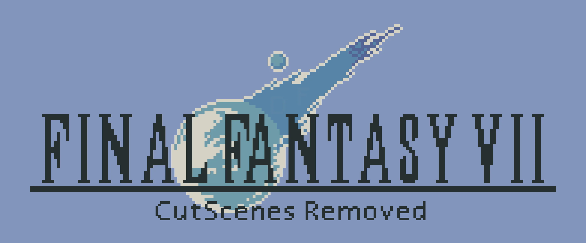
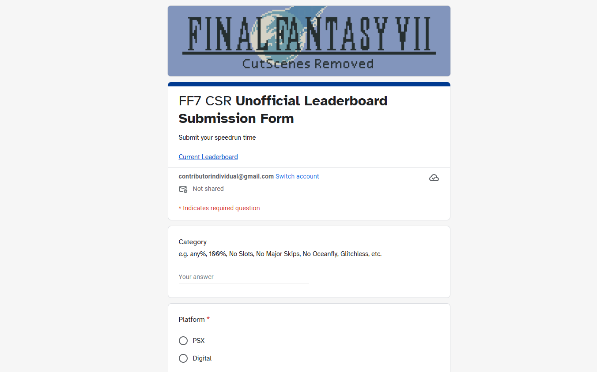

*Artist: @Cronosart99*

## Final Fantasy VII PSX & PC CutScenes Removed (CSR)

Category | CSR | CSR+ | CSR++
-------- | ------ | ------ | ------
any% | 🟢 Done | 🔄 WIP | 🔄 WIP
any% No Slots | 🟢 Done | 🔄 WIP | 🔄 WIP
any% Slots | 🟢 Done | 🔄 WIP | 🔄 WIP
any% No Major Skips | 🟢 Done | 🔄 WIP | 🔄 WIP
any% All Bosses | 🔄 WIP | 🔄 WIP | 🔄 WIP
100% No Slots | 🔄 WIP | 🔄 WIP | 🔄 WIP

*Est. Completion Time: 1 bazillion years*

Platforms: PS1 / PS2 disc, emulator, or PC via TMD's [Windows installer](https://drive.google.com/file/d/1VXQtJZD6TrG3RXO6kPYduW5EGEBmQsAP/view?usp=drive_link).

## Definitions

### CSR (base)

Skill checks stay (dialogue choices, movement in cutscenes, skips, RNG manip, etc.). Most FMVs removed, some cutscenes shortened, long mash sequences reduced. Plays like a normal run, shorter. Selectable in the builder as a base, alongside Unmodified.

### CSR+ scene add-ons

Individual, mixable trims that go further than CSR for a specific scene — pick and choose only the ones you want on top of the CSR base, instead of committing to a whole extra tier. Currently ships one: `csr-plus-scene-aerith-house` (Aerith's house cutscene). More will be added as they're decomposed from the old monolithic CSR+ pack.

### CSR++ (retired from the builder)

Very aggressively trimmed CSR+: some game story mechanics, option choices, and complete dialogue removal. No longer published to the builder — it's different enough to be its own project, and is being continued separately in Makou Reactor. Files stay in this repo (`bases/csr-plusplus/`, `builder/csr-plusplus-v0.1.1/`) but are unpublished (removed from `builder/manifest.json`).

## Changelogs

| Base / add-on | Changelog | Builder id |
|------|-----------|--------------------|
| CSR (base) | [bases/csr/CHANGELOG.md](bases/csr/CHANGELOG.md) | `csr-v0.14.1` |
| CSR+ scene add-ons | [bases/csr-plus/CHANGELOG.md](bases/csr-plus/CHANGELOG.md) | `csr-plus-scene-aerith-house-v0.1.0`, more to come |
| CSR++ (unpublished) | [bases/csr-plusplus/CHANGELOG.md](bases/csr-plusplus/CHANGELOG.md) | `csr-plusplus-v0.1.1` (files kept, not in manifest) |

## Play

https://individualcontributor.dev/builder/

1. Clean **NTSC-U** `.bin` (disc auto-detected)
2. Pick a base: Unmodified or CSR
3. Add any CSR+ scene add-ons and/or Field/World encounter density
4. Build zip → `.bin` + `.cue` + `APPLIED.txt`

Emulator: [DuckStation](https://github.com/stenzek/duckstation/releases) or RetroArch + SwanStation — open the `.cue`.

PSX: soft-mod (e.g. [MechaPwn](https://github.com/MechaResearch/MechaPwn)), burn from the `.cue`.

## Release a base (maintainers)

Local images (gitignored) under `workspace/`:

| Role | Path |
|------|------|
| Pristine | `workspace/pristine/FINALFANTASY7_DN.bin` |
| CSR | `workspace/csr/FINALFANTASY7_DN.bin` |
| CSR+ | `workspace/csr-plus/FINALFANTASY7_DN.bin` |
| CSR++ | `workspace/csr-plusplus/FINALFANTASY7_DN.bin` |

### Clean EDC before layer rebuild (important)

Makou/CDmage injects often **zero Mode2 Form1 footers**. Diffing that bakes EDC zeros into `builder/` layers (ImgBurn verify noise; builder now repairs on apply as a safety net).

Before `build_csr_base_layers.py`, repair each patched disc against pristine:

```bash
# names must be FINALFANTASY7_D1.bin … (rename Redump titles if needed)
python scripts/repair_mode2_edc.py \
  --pristine workspace/pristine/FINALFANTASY7_D1.bin \
  --input workspace/csr-plus/FINALFANTASY7_D1.bin \
  --in-place
# repeat for D2/D3 and for csr / csr-plusplus
```

Then rebuild layers as usual. Expect far fewer records (no thousands of footer-only zeros).

```bash
cd /c/path/to/Final-Fantasy-7-CSR   # Git Bash on Windows
git pull

# one base at a time — bump version, update bases/<base>/CHANGELOG.md
python scripts/build_csr_base_layers.py workspace/csr --version 0.14.2
# python scripts/build_csr_base_layers.py workspace/csr-plus --version 0.1.2
# python scripts/build_csr_base_layers.py workspace/csr-plusplus --version 0.1.2

git add builder/ bases/
git commit -m "Release CSR v0.14.2."
git push
```

Pages serves `builder/` JSON for the disc builder. Older packs stay enabled until you set `"enabled": false` in `builder/manifest.json`.

If the published base **id** changed (e.g. `csr-v0.14.2`), rebuild Field encounter packs in **Final-Fantasy-7-Modding** against the new ids.

## Layout

```
bases/           CHANGELOG.md per base (csr, csr-plus, csr-plusplus)
builder/         published layers + manifest.json (Pages CDN)
scripts/         build_csr_base_layers.py + layer helpers
workspace/       local pristine / patched .bins (not committed)
images/          README assets
```

## Contributors

IndividualContributor, Okamikaze, AwesomeWaves, Teeejj, Shoutblaster, HopeDRG, Doumeis, Cornfed69, Phek1200, MuscleBelt, Rendall, Expans3, Katombaz, Jayrod, TMD

## Leaderboard / feedback

- [Submit time](https://forms.gle/byFWCT85gFWS2Vtp6) · [Leaderboard](https://docs.google.com/spreadsheets/d/19y6yHtODjS5R-VyvtHUKjAo3FL9Fif56p1REQsUzGWg)
- [Feature requests / bugs](https://forms.gle/dW9rMCD9kQ3eBPSM8)



## Troubleshooting

Keep each disc’s `.bin` and `.cue` in the same folder with the same stem. The `.cue` `FILE` line must match the `.bin` name. Update any `.m3u` to the patched cues.
